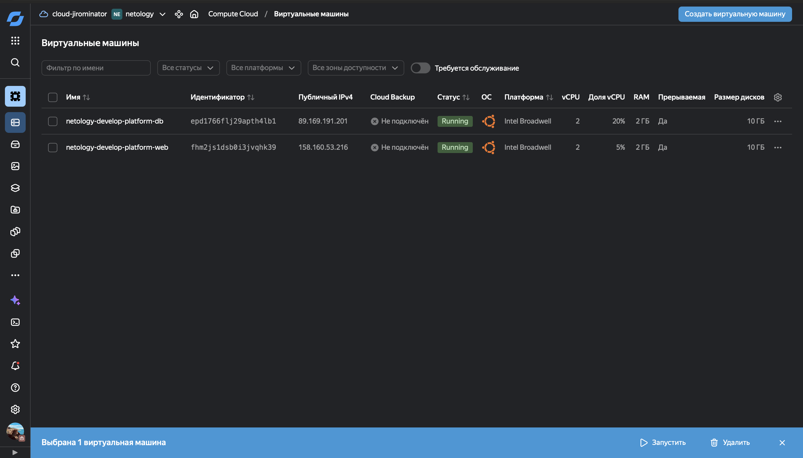
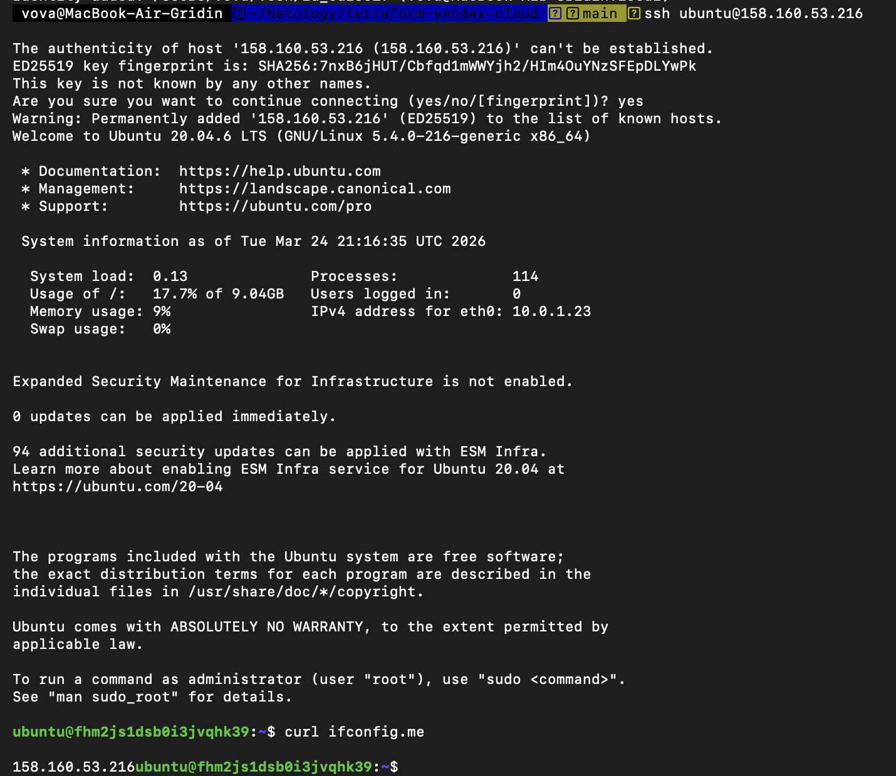

# Домашнее задание к занятию «Основы Terraform. Yandex Cloud»

## Выполнил: Гридин Владимир

---

### Задание 1

Внешние IP адреса:
- Web: `158.160.53.216`
- DB: `89.169.191.201`




### Ответы на вопросы

- `preemptible = true` — прерываемая ВМ, дешевле для тестов
- `core_fraction = 5` — 5% производительности CPU, экономия ресурсов

---

## Задание 2

Все хардкод-значения вынесены в переменные с префиксом `vm_web_`:

- `vm_web_family`
- `vm_web_name`
- `vm_web_platform_id`
- `vm_web_cores`
- `vm_web_memory`
- `vm_web_core_fraction`
- `vm_web_preemptible`
- `vm_web_nat`

Проверка `terraform plan`:

No changes. Your infrastructure matches the configuration.


---

## Задание 3

Создан файл `vms_platform.tf` с переменными для обеих ВМ.

Добавлена вторая ВМ `netology-develop-platform-db`:
- Зона: `ru-central1-b`
- Ресурсы: `cores = 2, memory = 2, core_fraction = 20`
- Подсеть: `10.0.2.0/24`

Переменные с префиксом `vm_db_`:

- `vm_db_family`
- `vm_db_name`
- `vm_db_platform_id`
- `vm_db_cores` (закомментировано в задании 6)
- `vm_db_memory` (закомментировано в задании 6)
- `vm_db_core_fraction` (закомментировано в задании 6)
- `vm_db_preemptible`
- `vm_db_nat`
- `vm_db_zone`

---

## Задание 4

Создан `outputs.tf` с output `all_vms_info`, содержащим:
- `instance_name`
- `external_ip`
- `fqdn`

### Вывод `terraform output`:

```hcl
all_vms_info = {
  "db" = {
    "external_ip" = "89.169.191.201"
    "fqdn" = "epd1766flj29apth4lb1.auto.internal"
    "instance_name" = "netology-develop-platform-db"
  }
  "web" = {
    "external_ip" = "158.160.53.216"
    "fqdn" = "fhm2js1dsb0i3jvqhk39.auto.internal"
    "instance_name" = "netology-develop-platform-web"
  }
}
```

---

## Задание 5

Создан locals.tf с интерполяцией:

```hcl

locals {
  vm_web_name = "${var.vm_web_name}"
  vm_db_name  = "${var.vm_db_name}"
}
```

Имена ВМ в main.tf заменены на local.vm_web_name и local.vm_db_name.

---

## Задание 6

Созданы map-переменные:
vms_resources — ресурсы ВМ:

```hcl

vms_resources = {
  web = {
    cores         = 2
    memory        = 2
    core_fraction = 5
    hdd_size      = 10
    hdd_type      = "network-hdd"
  }
  db = {
    cores         = 2
    memory        = 2
    core_fraction = 20
    hdd_size      = 10
    hdd_type      = "network-ssd"
  }
}
```

vms_metadata — общие метаданные:

```hcl

vms_metadata = {
  serial-port-enable = 1
  ssh-keys           = "ubuntu:..."
}
```

Закомментированы неиспользуемые переменные: vm_web_cores, vm_web_memory, vm_web_core_fraction, vm_db_cores, vm_db_memory, vm_db_core_fraction.

Проверка terraform plan:
```plain

No changes. Your infrastructure matches the configuration.

```

Структура репозитория

```plain

.
├── .gitignore
├── .terraformrc
├── README.md
├── locals.tf           # задание 5
├── main.tf             # основная логика
├── outputs.tf          # задание 4
├── providers.tf        # провайдеры
├── variables.tf        # общие переменные
└── vms_platform.tf     # задание 3, 6
```
